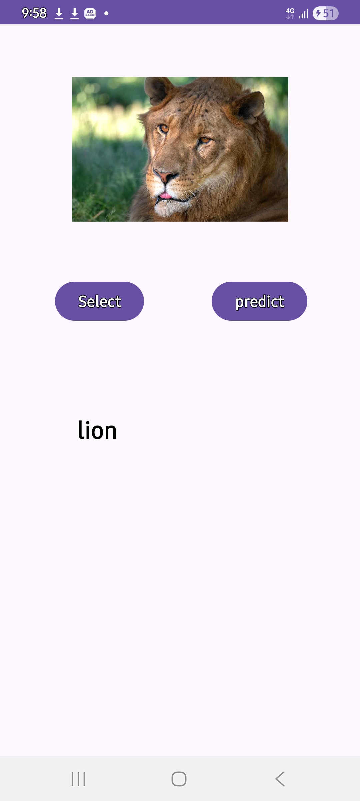
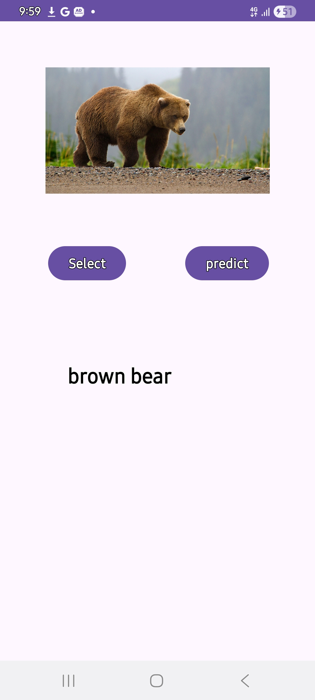

# 📷 ImagePredictorApp

An Android application that uses **TensorFlow Lite MobileNet V1** to perform real-time image classification directly on a mobile device. Users can select an image from their gallery, and the application predicts the most probable object present in the image from over **1000 ImageNet categories**.

---

# 🚀 Problem Statement

Identifying objects in images traditionally requires human observation or cloud-based AI services. Such approaches may:

* Require internet connectivity.
* Introduce latency due to server communication.
* Raise privacy concerns when images are uploaded to external servers.
* Increase infrastructure costs for developers.

There is a need for a lightweight, fast, and privacy-preserving solution that can perform image recognition directly on mobile devices.

---

# 💡 Solution

ImagePredictorApp leverages **TensorFlow Lite** and a pre-trained **MobileNet V1 Quantized Model** to perform image classification completely on-device.

The application allows users to:

1. Select an image from their device gallery.
2. Process and resize the image to the required model dimensions.
3. Run inference using a TensorFlow Lite model.
4. Display the predicted object category instantly.

All processing occurs locally on the device without requiring internet access.

---

# 🎯 Objectives

* Demonstrate the integration of TensorFlow Lite in Android applications.
* Enable real-time image classification on mobile devices.
* Provide an educational example of on-device machine learning.
* Showcase efficient AI deployment using quantized models.

---

# 🛠 Technology Stack

## Mobile Development

* Kotlin
* Android SDK
* Android Studio

## Machine Learning

* TensorFlow Lite
* MobileNet V1 Quantized Model

## UI Components

* ConstraintLayout
* ImageView
* TextView
* Button

---

# 🧠 Machine Learning Model

The application uses:

### MobileNet V1 Quantized

**Characteristics:**

* Lightweight architecture optimized for mobile devices.
* Fast inference speed.
* Reduced model size through quantization.
* Supports 1000 ImageNet object categories.

**Input:**

* Image Size: 224 × 224
* Channels: RGB
* Tensor Shape: (1, 224, 224, 3)

**Output:**

* Probability scores for 1000 object classes.

---

# 📂 Project Structure

```text
ImagePredictorApp
│
├── app
│   ├── manifests
│   │   └── AndroidManifest.xml
│   │
│   ├── java
│   │   └── MainActivity.kt
│   │
│   ├── assets
│   │   └── label.txt
│   │
│   ├── ml
│   │   └── MobilenetV110224Quant
│   │
│   └── res
│       ├── layout
│       │   └── activity_main.xml
│       └── drawable
│
└── README.md
```

---

# ⚙️ Application Workflow

### Step 1: Select Image

The user clicks the **Select** button.

```kotlin
intent.type = "image/*"
```

The gallery opens and allows image selection.

### Step 2: Display Image

The selected image is displayed using an ImageView.

```kotlin
imgview.setImageURI(data?.data)
```

### Step 3: Preprocess Image

The image is resized to the dimensions expected by the model.

```kotlin
Bitmap.createScaledBitmap(bitmap, 224, 224, true)
```

### Step 4: Convert to Tensor

The image is transformed into TensorFlow Lite tensor format.

```kotlin
TensorImage.fromBitmap(resized)
```

### Step 5: Run Prediction

The MobileNet model performs inference.

```kotlin
val outputs = model.process(inputFeature0)
```

### Step 6: Display Result

The application finds the highest probability score and displays the corresponding label.

```kotlin
tv.setText(townList[max])
```

---

# 📱 User Interface

The application consists of:

### Image Preview

Displays the selected image.

### Select Button

Allows users to choose an image from the gallery.

### Predict Button

Runs the TensorFlow Lite model.

### Prediction Text

Displays the predicted object category.

---

# ✨ Features

* On-device image classification.
* Fast prediction using TensorFlow Lite.
* Works offline.
* Lightweight and efficient.
* Simple and intuitive user interface.
* Supports over 1000 ImageNet classes.
* No server communication required.
* Privacy-friendly image processing.

---

# 🔍 Supported Categories

The application can classify images into more than 1000 ImageNet categories, including:

### Animals

* Dog
* Cat
* Lion
* Tiger
* Elephant
* Panda
* Bear
* Zebra

### Birds

* Eagle
* Owl
* Peacock
* Toucan
* Flamingo

### Vehicles

* Airliner
* Ambulance
* Bicycle
* Jeep
* Sports Car

### Food

* Pizza
* Cheeseburger
* Hotdog
* Ice Cream
* Burrito

### Objects

* Laptop
* Keyboard
* Camera
* Backpack
* Clock

And many more.

---

# 📊 Benefits

### Speed

Inference runs directly on the device with minimal latency.

### Privacy

Images never leave the user's device.

### Offline Availability

No internet connection required.

### Low Resource Consumption

Quantized MobileNet reduces memory and storage usage.

### Scalability

Can be extended with custom-trained TensorFlow Lite models.

---

# 🔮 Future Enhancements

* Camera-based real-time prediction.
* Top-5 prediction results.
* Confidence score display.
* Custom model support.
* Voice output for predictions.
* Dark mode UI.
* History of previous predictions.
* Multi-language support.

---

# 📸 Screenshots

<p align="center">
  
  
</p>

---

# 🧪 How to Run

## Clone Repository

```bash
git clone https://github.com/vaidiknakrani/ImagePredictorApp.git
```

## Open in Android Studio

```text
File → Open → Select Project Folder
```

## Build Project

```text
Sync Gradle → Build → Run
```

## Run Application

Use either:

* Physical Android Device
* Android Emulator

---

# 📚 Learning Outcomes

This project demonstrates:

* Android development using Kotlin.
* TensorFlow Lite integration.
* Machine learning deployment on mobile devices.
* Image preprocessing techniques.
* Mobile AI application development.
* Working with TensorBuffer and TensorImage.

---

# 👨‍💻 Author

**Vaidik Nakrani**

B.Tech Computer Science & Engineering

* GitHub: https://github.com/vaidiknakrani

---

# 📄 License

This project is developed for educational and learning purposes. Feel free to use and modify it for academic projects and research.
